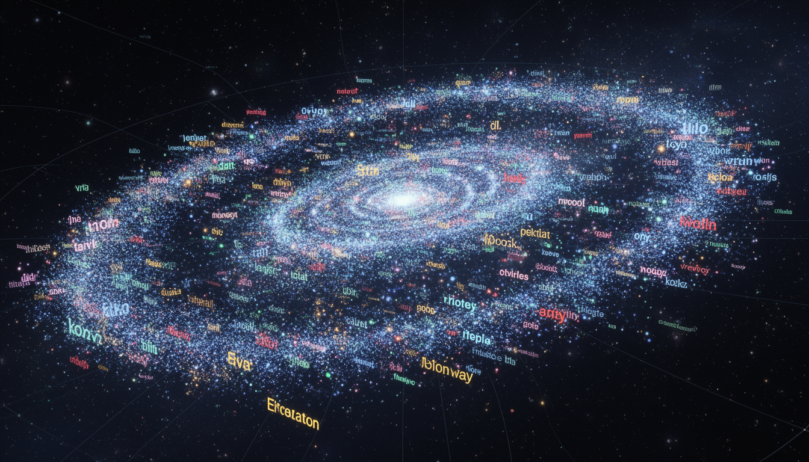

# Homework 6: Sentence Embeddings

**Points:** 20 | **Due:** Sunday, March 8, 2026 @ 11pm Pacific

**Author:** Richard Young, Ph.D. | UNLV Lee Business School

**Compute:** CPU (free tier) — GPU recommended for faster encoding

---

## Learning Objectives

1. **Understand** the difference between word and sentence embeddings
2. **Use** Sentence Transformers to encode text semantically
3. **Compute** semantic similarity between documents
4. **Build** a simple semantic search system
5. **Cluster** documents by meaning, not just keywords

---

## Why This Matters for Business

> **Semantic Search:** Google processes 8.5 billion searches daily. Traditional keyword matching fails when users search "laptop won't turn on" but the solution article says "computer not starting." Sentence embeddings understand meaning, not just words.

> **Customer Support:** Zendesk reduced ticket resolution time by 40% using semantic similarity to match incoming tickets with past solutions—even when customers describe the same problem differently.

> **Resume Screening:** LinkedIn matches job descriptions to candidate profiles using sentence embeddings. "5 years of machine learning experience" matches "extensive background in ML and AI" because the embeddings capture semantic equivalence.

> **Content Discovery:** Spotify's podcast recommendations use embeddings to find shows similar in meaning to what you've enjoyed—not just shows with matching tags or keywords.

---

## Grading

| Component | Points | Effort | What We're Looking For |
|-----------|--------|--------|------------------------|
| Model Loading | 3 | * | Load Sentence Transformer model |
| Text Encoding | 4 | * | Encode sentences/documents to vectors |
| Similarity Computation | 5 | ** | Compute and interpret cosine similarity |
| Semantic Search | 5 | ** | Build working search over your dataset |
| Analysis | 3 | ** | Interpret results, document limitations |
| **Total** | **20** | |

**Effort Key:** * Straightforward | ** Requires thinking | *** Challenge

---

## The Big Picture

**Word Embeddings** (HW4): "king" → [0.2, 0.5, ...]
**Sentence Embeddings** (This HW): "The king ruled wisely" → [0.1, 0.3, 0.7, ...]

Sentence embeddings capture the meaning of entire sentences, handling:
- Word order: "dog bites man" ≠ "man bites dog"
- Context: "bank" in "river bank" vs "bank account"
- Paraphrase: "I love this!" ≈ "This is amazing!"



---

## Understanding Cosine Similarity

Cosine similarity is the heart of semantic search. It measures how similar two vectors are by looking at the **angle** between them, not their length.


### The Intuition

Think of each sentence as an arrow pointing in some direction in high-dimensional space:
- **Similar sentences** point in similar directions → **small angle** → **high cosine similarity**
- **Different sentences** point in different directions → **large angle** → **low cosine similarity**

### The Formula

```
cosine_similarity(A, B) = (A · B) / (||A|| × ||B||)
```

Where:
- `A · B` = dot product (sum of element-wise multiplication)
- `||A||` = magnitude (length) of vector A

### Interpreting Scores

| Score | Interpretation | Example |
|-------|---------------|---------|
| **0.9 - 1.0** | Nearly identical meaning | "I love this" ↔ "I really love this" |
| **0.7 - 0.9** | Very similar | "Great movie!" ↔ "Excellent film!" |
| **0.5 - 0.7** | Somewhat related | "Great movie!" ↔ "Good entertainment" |
| **0.3 - 0.5** | Weakly related | "Great movie!" ↔ "I watched something" |
| **0.0 - 0.3** | Unrelated | "Great movie!" ↔ "The weather is cold" |

### Why Cosine Over Euclidean Distance?

Cosine similarity ignores vector magnitude—only direction matters. This is crucial because:
- A long review and short review about the same topic should be similar
- We care about **what** is said, not **how much** is said

```python
# Quick example
from sklearn.metrics.pairwise import cosine_similarity

# These will have HIGH similarity (same meaning)
sim = cosine_similarity(
    model.encode(["I love this movie"]),
    model.encode(["This film is amazing"])
)[0][0]  # ≈ 0.89

# These will have LOW similarity (different topics)
sim = cosine_similarity(
    model.encode(["I love this movie"]),
    model.encode(["The weather is cold"])
)[0][0]  # ≈ 0.12
```

---

## Instructions

1. Open `MIS769_HW6_Sentence_Embeddings.ipynb` in Google Colab
2. Load a Sentence Transformer model
3. Encode your dataset's text into embeddings
4. Compute similarities between document pairs
5. Build a semantic search: given a query, find the most similar documents
6. Analyze: What works well? What fails?

---

## What Your Output Should Look Like

**Model Loading:**
```
📊 MODEL LOADED
============================================================
Model: all-MiniLM-L6-v2
Embedding dimension: 384
Max sequence length: 256
```

**Similarity Examples:**
```
🔍 SEMANTIC SIMILARITY
============================================================
Sentence A: "The movie was absolutely fantastic!"
Sentence B: "I loved this film, it was great!"
Similarity: 0.89 ✓ High (same sentiment, different words)

Sentence A: "The movie was absolutely fantastic!"
Sentence B: "The movie was terrible and boring."
Similarity: 0.34 ✗ Low (opposite sentiment)

Sentence A: "The bank is by the river."
Sentence B: "I need to visit the bank for a loan."
Similarity: 0.42 (different meanings of "bank")
```

**Semantic Search:**
```
🔎 SEMANTIC SEARCH RESULTS
============================================================
Query: "movies with surprising plot twists"

Top 5 Results:
1. [0.82] "The ending completely caught me off guard..."
2. [0.79] "Never saw that twist coming, mind blown!"
3. [0.76] "Predictable at first but the finale shocked me"
4. [0.71] "Great storytelling with unexpected turns"
5. [0.68] "The plot kept me guessing until the end"
```

---

## Common Mistakes (and How to Avoid Them)

| Mistake | Symptom | Fix |
|---------|---------|-----|
| Wrong model for task | Poor similarity scores | Use `all-MiniLM-L6-v2` for general use |
| Not normalizing embeddings | Cosine similarity > 1 | Model outputs are already normalized |
| Encoding one text at a time | Very slow | Use `model.encode(list_of_texts)` for batches |
| Texts too long | Truncation warnings | Most models have 256-512 token limit |
| Comparing different domains | Low similarities | Fine-tune or use domain-specific model |
| Using L2 distance instead of cosine | Results seem wrong | Use `cosine_similarity` from sklearn |

**If you see this error:**
```python
RuntimeError: CUDA out of memory
```
**Fix:** Reduce batch size: `model.encode(texts, batch_size=32)`

**If encoding is slow:**
- Use GPU: In Colab, Runtime → Change runtime type → GPU
- Reduce batch size if memory limited
- Use a smaller model: `all-MiniLM-L6-v2` is fast

---

## Questions to Answer

- **Q1:** What makes two sentences similar according to the model?
- **Q2:** Find an example where semantic search works better than keyword search.
- **Q3:** Find an example where the model fails. Why might this happen?
- **Q4:** How would you use this in a business application?

---

## Going Deeper (Optional Challenges)

### Challenge A: Multi-lingual Embeddings
Use `paraphrase-multilingual-MiniLM-L12-v2` to embed text in multiple languages. Show that "I love this movie" (English) has high similarity to "J'adore ce film" (French).

### Challenge B: Document Clustering
Use K-Means on your sentence embeddings to cluster reviews. Do the clusters represent meaningful categories? Visualize with t-SNE.

### Challenge C: Fine-Tuning
Fine-tune a Sentence Transformer on your specific domain using contrastive learning. Compare similarity scores before and after fine-tuning.

---

## Quick Reference

```python
# Install
!pip install sentence-transformers

# Load model
from sentence_transformers import SentenceTransformer

model = SentenceTransformer('all-MiniLM-L6-v2')

# Encode single sentence
embedding = model.encode("This is a sentence")
print(f"Shape: {embedding.shape}")  # (384,)

# Encode multiple sentences (faster)
sentences = ["First sentence", "Second sentence", "Third sentence"]
embeddings = model.encode(sentences)
print(f"Shape: {embeddings.shape}")  # (3, 384)

# Compute cosine similarity
from sklearn.metrics.pairwise import cosine_similarity
import numpy as np

emb1 = model.encode(["I love this movie"])
emb2 = model.encode(["This film is amazing"])
similarity = cosine_similarity(emb1, emb2)[0][0]
print(f"Similarity: {similarity:.3f}")  # ~0.85

# Semantic search
query = "exciting action scenes"
query_emb = model.encode([query])

# Assume corpus_embeddings is pre-computed
similarities = cosine_similarity(query_emb, corpus_embeddings)[0]
top_indices = np.argsort(similarities)[::-1][:5]

for idx in top_indices:
    print(f"[{similarities[idx]:.2f}] {corpus[idx][:50]}...")

# Built-in semantic search (faster for large corpora)
from sentence_transformers import util

hits = util.semantic_search(query_emb, corpus_embeddings, top_k=5)
for hit in hits[0]:
    print(f"[{hit['score']:.2f}] {corpus[hit['corpus_id']][:50]}...")
```

**Popular Sentence Transformer Models:**
| Model | Dimensions | Speed | Quality | Use Case |
|-------|-----------|-------|---------|----------|
| `all-MiniLM-L6-v2` | 384 | Fast | Good | General purpose |
| `all-mpnet-base-v2` | 768 | Medium | Best | When quality matters |
| `paraphrase-MiniLM-L6-v2` | 384 | Fast | Good | Paraphrase detection |
| `multi-qa-MiniLM-L6-cos-v1` | 384 | Fast | Good | Question answering |

---

## Submission

Upload to Canvas:
- Your completed `.ipynb` notebook with all cells executed

---

\vspace{1cm}

*— Richard Young, Ph.D.*
