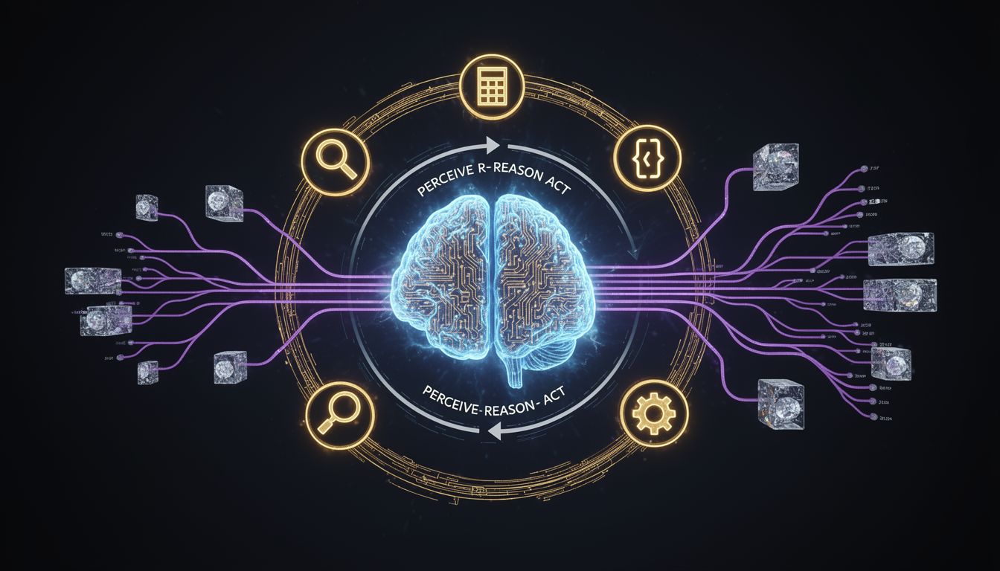

# Homework 10: Business Agent

**Points:** 20 | **Due:** Sunday, April 19, 2026 @ 11pm Pacific

**Author:** Richard Young, Ph.D. | UNLV Lee Business School

**Compute:** CPU (free tier)

---

## Learning Objectives

1. **Understand** what AI agents are and how they work
2. **Build** an agent that can use tools to accomplish tasks
3. **Design** agents for specific business workflows
4. **Implement** the ReAct (Reasoning + Acting) pattern
5. **Evaluate** agent behavior and handle failures gracefully

---

## Why This Matters for Business

> **Autonomous Operations:** Klarna's AI agent handles 2.3 million customer service conversations monthly—doing the work of 700 full-time agents. It doesn't just answer questions; it takes actions like processing refunds and updating accounts.

> **Sales Automation:** HubSpot's AI agents qualify leads, schedule meetings, and update CRM records automatically. Sales reps focus on closing deals while agents handle the repetitive coordination work.

> **Financial Analysis:** Morgan Stanley's AI agents pull data from multiple sources, generate reports, and flag anomalies—tasks that took analysts hours now happen in seconds.

> **The Agent Revolution:** Sam Altman predicts AI agents will be "the biggest platform shift in computing history." Businesses that master agents now will have a significant competitive advantage.

---

## Grading

| Component | Points | Effort | What We're Looking For |
|-----------|--------|--------|------------------------|
| Agent Setup | 3 | * | Basic agent with tool access |
| Tool Design | 5 | ** | Useful, well-defined tools |
| ReAct Loop | 5 | ** | Reasoning → Action → Observation cycle |
| Business Task | 5 | ** | Solve a real business problem |
| Error Handling | 2 | * | Graceful failure, retry logic |
| **Total** | **20** | |

**Effort Key:** * Straightforward | ** Requires thinking | *** Challenge

---

## The Big Picture

An **AI Agent** = LLM + Tools + Loop

```
User Request
     ↓
┌─────────────────────────────────────┐
│  AGENT LOOP                         │
│                                     │
│  1. THINK: What should I do next?   │
│  2. ACT: Choose and use a tool      │
│  3. OBSERVE: Process tool result    │
│  4. REPEAT until task complete      │
│                                     │
└─────────────────────────────────────┘
     ↓
Final Answer
```

Unlike simple LLM calls, agents can:
- Take multiple steps to solve problems
- Use external tools (search, calculate, query databases)
- Adapt their strategy based on results
- Handle complex, multi-step workflows



---

## Instructions

1. Open `MIS769_HW10_Business_Agent.ipynb` in Google Colab
2. Understand the ReAct pattern
3. Define 2-3 tools your agent can use
4. Build the agent loop
5. Test on a business scenario
6. Document the agent's reasoning and actions

---

## What Your Output Should Look Like

**Agent Tools:**
```
🔧 AVAILABLE TOOLS
============================================================
1. search_products(query) → List of matching products
2. get_price(product_id) → Current price
3. check_inventory(product_id) → Stock status
4. calculate_discount(price, percent) → Discounted price
```

**Agent Execution (ReAct Pattern):**
```
📋 TASK: "Find the cheapest laptop with at least 16GB RAM in stock"

🤔 THOUGHT 1: I need to search for laptops with 16GB RAM first.
🔨 ACTION: search_products("laptop 16GB RAM")
👁️ OBSERVATION: Found 5 products: [LP001, LP002, LP003, LP004, LP005]

🤔 THOUGHT 2: Now I need to check prices for all these products.
🔨 ACTION: get_price("LP001")
👁️ OBSERVATION: $899

🔨 ACTION: get_price("LP002")
👁️ OBSERVATION: $749

🔨 ACTION: get_price("LP003")
👁️ OBSERVATION: $1,299

🔨 ACTION: get_price("LP004")
👁️ OBSERVATION: $649

🔨 ACTION: get_price("LP005")
👁️ OBSERVATION: $799

🤔 THOUGHT 3: LP004 is cheapest at $649. Let me verify it's in stock.
🔨 ACTION: check_inventory("LP004")
👁️ OBSERVATION: In Stock (23 units)

🤔 THOUGHT 4: LP004 is the cheapest at $649 and is in stock. Task complete.

✅ FINAL ANSWER:
The cheapest laptop with 16GB RAM that's in stock is LP004
(TechPro UltraBook) at $649. There are 23 units available.
```

**Business Scenario:**
```
📊 BUSINESS AGENT: Customer Support
============================================================
Customer: "I ordered product #12345 last week and it hasn't
arrived. Can you help?"

Agent Trace:
1. THINK: Need to look up order status
2. ACTION: lookup_order("12345")
3. OBSERVE: Order shipped 3 days ago, tracking: TRK789
4. THINK: Should check delivery status
5. ACTION: check_tracking("TRK789")
6. OBSERVE: Package delayed, expected tomorrow
7. THINK: Should offer resolution
8. ACTION: apply_credit(order_id="12345", amount=10)
9. OBSERVE: $10 credit applied successfully

RESPONSE: "I found your order #12345. It shipped 3 days ago but
is experiencing a slight delay—it should arrive tomorrow.
I've applied a $10 credit to your account for the inconvenience.
Would you like me to email you the tracking link?"
```

---

## Common Mistakes (and How to Avoid Them)

| Mistake | Symptom | Fix |
|---------|---------|-----|
| No loop termination | Agent runs forever | Add max_steps limit |
| Tools with unclear names | Agent picks wrong tool | Use descriptive names + docstrings |
| No error handling | Agent crashes on tool failure | Catch exceptions, retry or report |
| Tools returning too much data | Token limit exceeded | Summarize tool outputs |
| Vague task description | Agent gets confused | Be specific about success criteria |
| No observation parsing | Agent ignores tool results | Explicitly include observations in prompt |

**If the agent gets stuck in a loop:**
- Add "If you've tried 3 times, report failure and stop"
- Limit max iterations: `for i in range(10):`

**If the agent picks wrong tools:**
- Improve tool descriptions
- Add few-shot examples of correct tool usage
- Make tool names more descriptive

---

## Questions to Answer

- **Q1:** Describe your agent's tools. Why did you choose them?
- **Q2:** Walk through one complete agent trace. What worked well?
- **Q3:** When did the agent fail? How would you improve it?
- **Q4:** How could this agent save time in a real business?

---

## Going Deeper (Optional Challenges)

### Challenge A: Multi-Agent System
Build two agents that can collaborate. Example: A "Researcher" agent finds information, and an "Analyst" agent interprets it. How do they communicate?

### Challenge B: Memory-Enhanced Agent
Add memory so your agent remembers previous conversations. Can it handle follow-up questions like "What about the second option you mentioned?"

### Challenge C: Self-Improving Agent
Let the agent learn from failures. If a tool call fails, have it record the mistake and avoid it in future runs.

---

## Quick Reference

```python
# Install dependencies
!pip install openai langchain

# 1. DEFINE TOOLS
tools = [
    {
        "name": "search_products",
        "description": "Search for products by keyword. Returns list of product IDs.",
        "parameters": {
            "type": "object",
            "properties": {
                "query": {"type": "string", "description": "Search query"}
            },
            "required": ["query"]
        }
    },
    {
        "name": "get_price",
        "description": "Get the current price for a product.",
        "parameters": {
            "type": "object",
            "properties": {
                "product_id": {"type": "string", "description": "Product ID"}
            },
            "required": ["product_id"]
        }
    }
]

# 2. IMPLEMENT TOOLS
def search_products(query):
    # Simulated product search
    return ["LP001", "LP002", "LP003"]

def get_price(product_id):
    prices = {"LP001": 899, "LP002": 749, "LP003": 1299}
    return prices.get(product_id, "Not found")

def execute_tool(name, args):
    if name == "search_products":
        return search_products(args["query"])
    elif name == "get_price":
        return get_price(args["product_id"])

# 3. BUILD AGENT LOOP
from openai import OpenAI
client = OpenAI()

def run_agent(task, max_steps=10):
    messages = [
        {"role": "system", "content": """You are a helpful agent.
        Think step by step. Use tools when needed.
        Format: THOUGHT: [reasoning] then ACTION: [tool_name(args)]"""},
        {"role": "user", "content": task}
    ]

    for step in range(max_steps):
        response = client.chat.completions.create(
            model="gpt-3.5-turbo",
            messages=messages,
            tools=tools
        )

        message = response.choices[0].message

        if message.tool_calls:
            # Execute tool
            tool = message.tool_calls[0]
            result = execute_tool(
                tool.function.name,
                eval(tool.function.arguments)
            )
            messages.append(message)
            messages.append({
                "role": "tool",
                "tool_call_id": tool.id,
                "content": str(result)
            })
            print(f"ACTION: {tool.function.name}")
            print(f"OBSERVATION: {result}")
        else:
            # Final answer
            print(f"FINAL: {message.content}")
            return message.content

    return "Max steps reached"

# 4. RUN AGENT
run_agent("Find the cheapest product in our catalog")
```

**Agent Architecture Patterns:**
| Pattern | Description | Use Case |
|---------|-------------|----------|
| ReAct | Reason → Act → Observe loop | General tasks |
| Plan-and-Execute | Plan all steps, then execute | Complex multi-step |
| Tree of Thoughts | Explore multiple paths | Ambiguous problems |
| Reflexion | Self-critique and improve | Iterative refinement |

**Common Agent Tools:**
| Tool Type | Examples | Business Use |
|-----------|----------|--------------|
| Search | Web search, DB query | Information gathering |
| Calculate | Math, analytics | Financial analysis |
| API | REST calls, webhooks | System integration |
| File | Read, write, parse | Document processing |
| Communication | Email, Slack | Notifications |

---

## Submission

Upload to Canvas:
- Your completed `.ipynb` notebook with all cells executed

---

\vspace{1cm}

*— Richard Young, Ph.D.*
