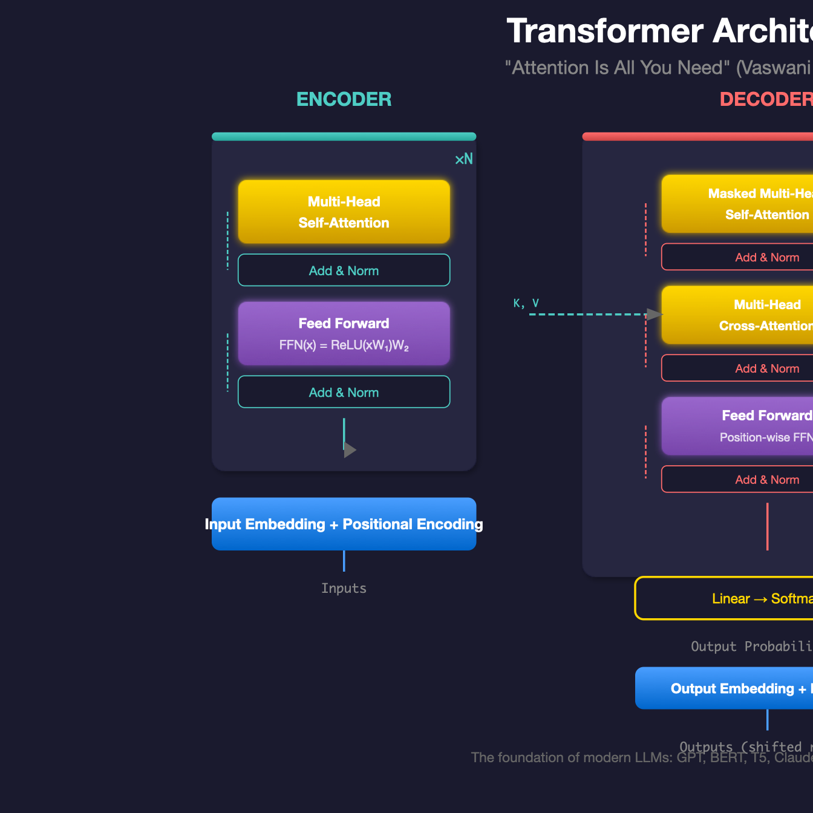

# Homework 9: Text Generation & HuggingFace Spaces Deployment

**Points:** 20 | **Due:** Sunday, April 12, 2026 @ 11pm Pacific

**Author:** Richard Young, Ph.D. | UNLV Lee Business School

**Compute:** GPU recommended for generation — Spaces deployment is free

---

## Learning Objectives

1. **Use** HuggingFace Transformers for text generation
2. **Understand** generation parameters (temperature, top-k, top-p)
3. **Build** an interactive demo with Gradio
4. **Deploy** your application to HuggingFace Spaces
5. **Share** a working AI application with the world

---

## Why This Matters for Business

> **Product Demos:** YC startups report that having a live demo on HuggingFace Spaces significantly improves investor meetings. It's one thing to describe your AI; it's another to let them try it.

> **Rapid Prototyping:** Notion's AI team uses Gradio demos to test features with internal stakeholders before engineering investment. Bad ideas die in demos; good ideas get built.

> **Portfolio Building:** Data scientists with deployed HuggingFace Spaces get 3x more recruiter interest than those with just GitHub repos. Employers want to see working applications, not just code.

> **Customer Feedback:** Hugging Face itself uses Spaces to get user feedback on new models within hours of release. Real users find real problems faster than any test suite.

---

## Grading

| Component | Points | Effort | What We're Looking For |
|-----------|--------|--------|------------------------|
| Text Generation | 4 | * | Generate coherent text with Transformers |
| Parameter Exploration | 4 | ** | Understand temp, top-k, top-p effects |
| Gradio Interface | 5 | ** | User-friendly interactive demo |
| Spaces Deployment | 5 | ** | Working public deployment |
| Documentation | 2 | * | Clear README and usage instructions |
| **Total** | **20** | |

**Effort Key:** * Straightforward | ** Requires thinking | *** Challenge

---

## The Big Picture

This homework takes you from local experimentation to public deployment:

```
Local Development → Gradio Demo → HuggingFace Spaces → Public URL
    (Colab)          (app.py)      (git push)        (Share!)
```

By the end, you'll have a live AI application that anyone can use—a real portfolio piece.



---

## Instructions

1. Open `MIS769_HW9_Text_Generation.ipynb` in Google Colab
2. Load a text generation model from HuggingFace
3. Experiment with generation parameters
4. Build a Gradio interface for your model
5. Create a HuggingFace Space and deploy your app
6. Share the public URL in your submission

---

## What Your Output Should Look Like

**Text Generation:**
```
📝 TEXT GENERATION
============================================================
Model: gpt2
Prompt: "The future of artificial intelligence"

Temperature 0.3 (Conservative):
"The future of artificial intelligence is likely to be shaped
by advances in machine learning and neural networks. Research
institutions are investing heavily in..."

Temperature 0.9 (Creative):
"The future of artificial intelligence might include robot
philosophers debating consciousness over quantum coffee while
humans wonder if they're the NPCs now..."
```

**Parameter Comparison:**
```
📊 GENERATION PARAMETERS
============================================================
Prompt: "Once upon a time"

| Setting          | Output Preview                    |
|-----------------|-----------------------------------|
| temp=0.1        | "...there was a king who ruled"   |
| temp=0.7        | "...in a land of floating cities" |
| temp=1.2        | "...quantum cats danced purple"   |
| top_k=50        | "...a brave knight set forth"     |
| top_p=0.9       | "...there lived a curious girl"   |
```

**Gradio Interface:**
```
🎨 GRADIO DEMO
============================================================
[Screenshot of your interface]

Features:
- Text input for prompt
- Slider for temperature (0.1 - 1.5)
- Slider for max length (50 - 500)
- Generate button
- Output text area
```

**Deployment Success:**
```
🚀 HUGGINGFACE SPACES
============================================================
Space URL: https://huggingface.co/spaces/YOUR_USERNAME/text-generator
Status: Running ✓
Visibility: Public
```

---

## Common Mistakes (and How to Avoid Them)

| Mistake | Symptom | Fix |
|---------|---------|-----|
| Model too large for Spaces | Out of memory, crashes | Use `gpt2` or `distilgpt2` for free tier |
| No `requirements.txt` | Import errors on Spaces | Include all dependencies |
| Wrong file name | App doesn't load | Must be `app.py` |
| Missing HF token | Private model access fails | Add token in Space settings |
| GPU model on CPU Space | Very slow or crashes | Use CPU-compatible model |
| Infinite generation | Hangs forever | Set `max_new_tokens` limit |

**If your Space shows "Building":**
- Check the Logs tab for errors
- Verify `requirements.txt` has correct package names
- Ensure `app.py` has no syntax errors

**If generation is too slow:**
- Use smaller model (`distilgpt2`)
- Limit `max_new_tokens` to 100-200
- Consider CPU-optimized models

---

## Questions to Answer

- **Q1:** How do temperature and top-p affect output creativity?
- **Q2:** What trade-offs did you make for Spaces deployment?
- **Q3:** What would you add to make this production-ready?
- **Q4:** Include your Spaces URL in your submission!

---

## Going Deeper (Optional Challenges)

### Challenge A: Model Comparison
Deploy a Space that lets users compare outputs from multiple models (GPT-2, DistilGPT-2, etc.) side by side.

### Challenge B: Fine-Tuned Model
Fine-tune GPT-2 on a specific domain (poems, code, recipes) and deploy it. How does domain-specific training change outputs?

### Challenge C: Streaming Output
Implement streaming text generation in your Gradio app so users see tokens appear one by one, like ChatGPT.

---

## Quick Reference

```python
# Install dependencies
!pip install transformers gradio torch

# 1. LOAD MODEL
from transformers import pipeline

generator = pipeline("text-generation", model="gpt2")

# 2. GENERATE TEXT
output = generator(
    "The future of AI",
    max_new_tokens=100,
    temperature=0.7,
    top_p=0.9,
    do_sample=True
)
print(output[0]['generated_text'])

# 3. BUILD GRADIO INTERFACE
import gradio as gr

def generate(prompt, temperature, max_length):
    result = generator(
        prompt,
        max_new_tokens=max_length,
        temperature=temperature,
        do_sample=True,
        pad_token_id=50256  # GPT-2 fix
    )
    return result[0]['generated_text']

demo = gr.Interface(
    fn=generate,
    inputs=[
        gr.Textbox(label="Prompt", placeholder="Enter your prompt..."),
        gr.Slider(0.1, 1.5, value=0.7, label="Temperature"),
        gr.Slider(50, 300, value=100, step=10, label="Max Length")
    ],
    outputs=gr.Textbox(label="Generated Text"),
    title="Text Generator",
    description="Generate creative text with GPT-2"
)

demo.launch()

# 4. DEPLOY TO SPACES
# Create files: app.py, requirements.txt

# requirements.txt:
# transformers
# gradio
# torch

# Then:
# 1. Go to huggingface.co/spaces
# 2. Create new Space (Gradio SDK)
# 3. Upload app.py and requirements.txt
# 4. Wait for build to complete
```

**Generation Parameters Explained:**
| Parameter | Effect | Typical Values |
|-----------|--------|----------------|
| `temperature` | Randomness (higher = more random) | 0.3-1.0 |
| `top_k` | Consider only top K tokens | 20-100 |
| `top_p` | Consider tokens summing to P probability | 0.8-0.95 |
| `max_new_tokens` | Maximum tokens to generate | 50-500 |
| `do_sample` | Enable sampling (vs. greedy) | True |
| `repetition_penalty` | Penalize repeated tokens | 1.0-1.5 |

**HuggingFace Spaces Structure:**
```
your-space/
├── app.py              # Main application (required)
├── requirements.txt    # Python dependencies (required)
└── README.md           # Space description (optional)
```

---

## Submission

Upload to Canvas:
- Your completed `.ipynb` notebook with all cells executed
- **Your HuggingFace Spaces URL** (e.g., `https://huggingface.co/spaces/username/app-name`)

---

\vspace{1cm}

*— Richard Young, Ph.D.*
